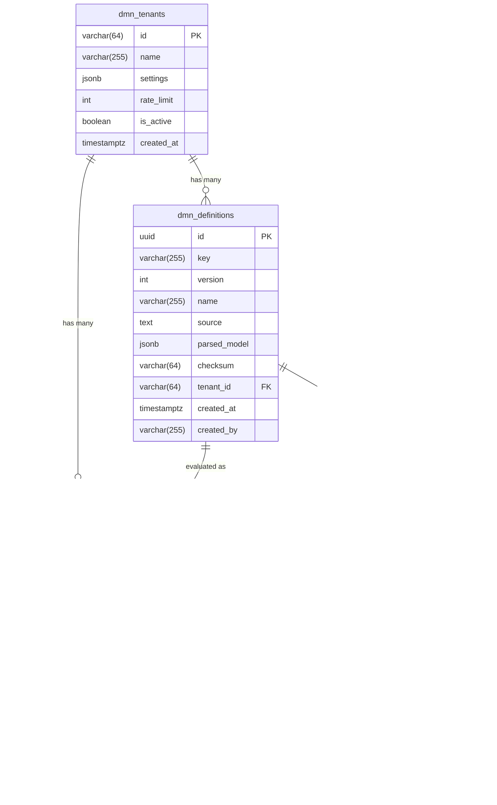

# DMN Engine Go — Диаграммы (Mermaid)

## 1. ER-диаграмма базы данных

## 2. Диаграмма компонентов

## 3. Диаграмма классов (Domain Model)

## 4. Диаграмма развёртывания

## 5. Sequence Diagram: Evaluate Decision

## 6. Sequence Diagram: Deploy Definition

## 7. State Diagram: Definition Lifecycle

## 8. Activity Diagram: Decision Evaluation

## 9. C4 Context Diagram

## 10. C4 Container Diagram

---

## Использование диаграмм

### GitHub/GitLab
Диаграммы Mermaid автоматически рендерятся в GitHub и GitLab при просмотре Markdown файлов.

### VS Code
Установите расширение "Markdown Preview Mermaid Support" для предпросмотра.

### Экспорт в PNG/SVG
Используйте [Mermaid Live Editor](https://mermaid.live/) для экспорта диаграмм в изображения.

### PlantUML альтернатива
Если нужен PlantUML формат, диаграммы можно конвертировать или пересоздать в PlantUML синтаксисе.

